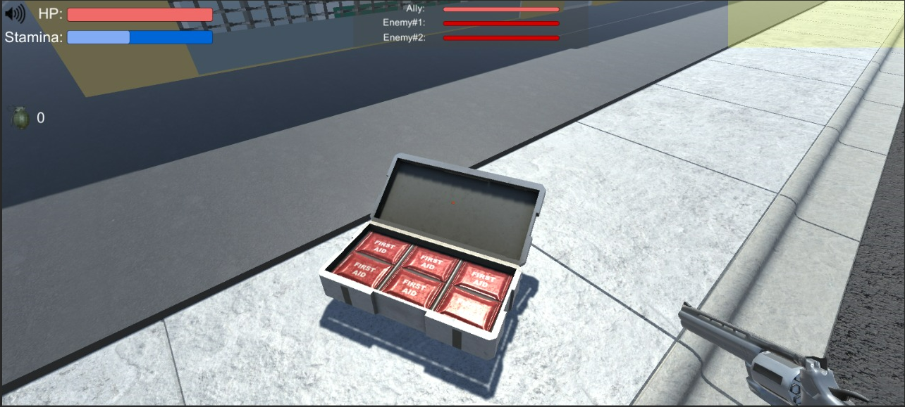
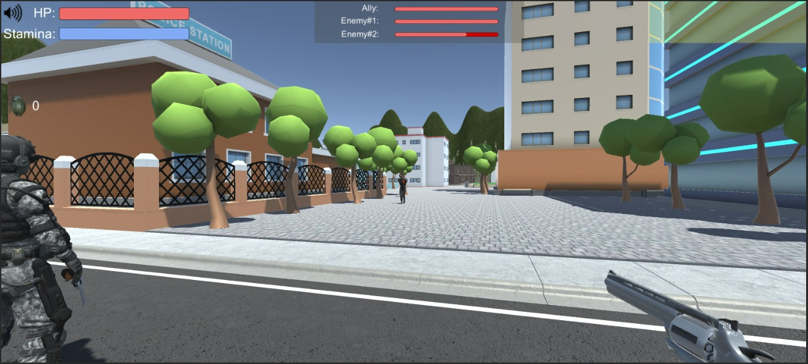
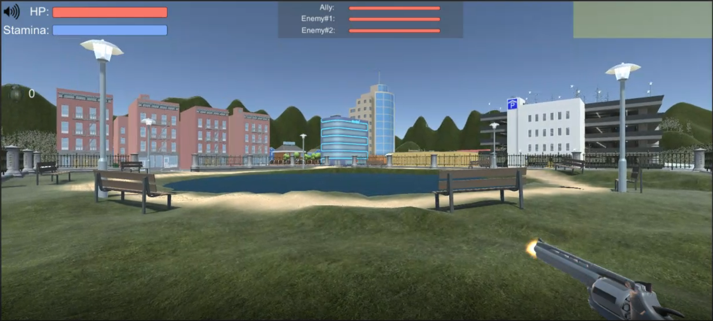
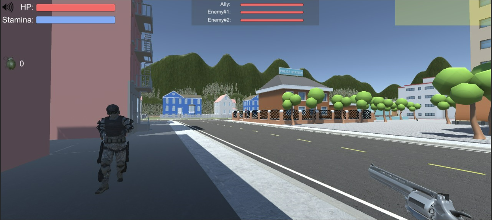
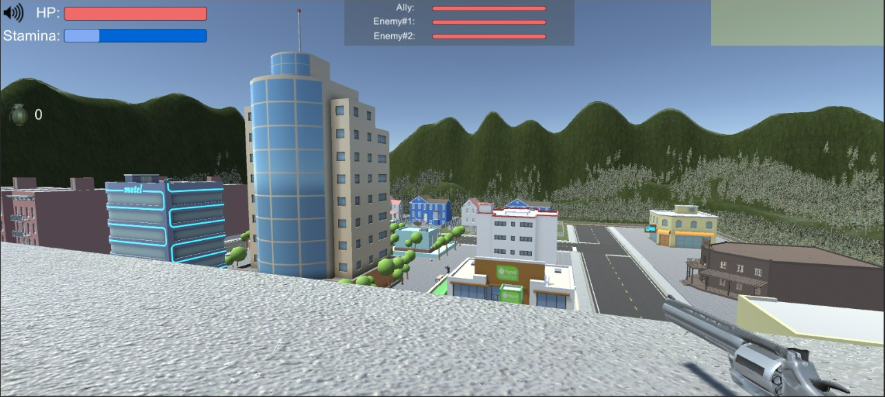

# GameDev--Final-Project
	This game was built as a final project for the game development course.
	This game was built with Unity and C# for the scripts.
	
	features:
	- Shoot
	- Computer npcs (ally and enemies)
	- Throw grenade
	- Collect HP/grenade from floor
	- Mute/unmute
	- Headshot and bodyshot impact hp difference
	- Stamina and hp bars
	- Sprint
	- Sound effects
	- Animations
	- Enemies are happy/sad depending if they win/lose
	
# Photos:
	
	
	
	
	
	
